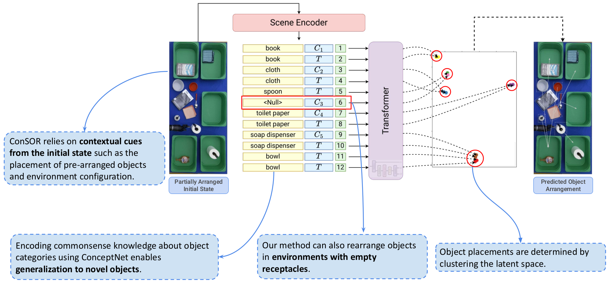

# ConSOR: A Context-Aware Semantic Object Rearrangement Framework for Partially Arranged Scenes

Full code release for the IROS 2023 paper "ConSOR: A Context-Aware Semantic
Object Rearrangement Framework for Partially Arranged Scenes". Link to paper: 
[ArXiv](https://arxiv.org/abs/2310.00371).
<p align="center">
    
</p>

For any issues in code or data, please contact Kartik Ramachandruni at kvr6 [at] gatech [dot] edu.

## Installing Packages

This project requires python 3.8.0. We recommend using an anaconda environment. Follow these steps to install the required packages:

- Install the Semantic AI2Thor Dataset module:

    ```
    pip install git+https://github.com/maxzuo/semantic-ai2thor-dataset
    ```

- (GPU required!) Install pytorch according to your system configuration from [here](https://pytorch.org/get-started/locally/).

- Install the remaining dependencies from `requirements.txt` using pip:

    ```
    pip install -r requirements.txt
    ```

- Weights & Biases is required to monitor ConSOR's training progress. Follow this link to setup your account: [Weights & Biases](https://docs.wandb.ai/quickstart).

## Downloading the Dataset and Model Files

Download the dataset and model files from this link: [dataset](https://www.dropbox.com/scl/fi/5o6o5ophdr89cwjf5ilne/consor_data.zip?rlkey=299ixa007in6gnp0zshbsvtrt&dl=0). Move this dataset to a new folder called `./files`. The dataset includes train, val, and test data in the relevant formats for each model. Model checkpoints include weights for ConSOR and the Abdo-CF baseline. We also include the few-shot demonstrations used for GPT-3 and the reponses generated by GPT-3.

## Generating Arranged Scenes per Schema
To generate new rearrangement data, run the following command:

```
python generate_data.py --config_file_path configs/data_config.yaml
```

This command saves the data as json files for training, validation, and testing. Testing data is
split into scenes using seen objects and scenes using unseen objects.
- To convert the json data into tensors (for ConSOR), run:
    ```
    python save_json_to_tensor.py --config_file_path data_config.yaml
    ```
- To convert the json data into pairwise ranking matrices (for the Abdo-CF baseline), run:
    ```
    python save_json_to_rank_matrix.py --config_file_path data_config.yaml
    ```

## Training and Evaluation

The following commands can be used to train and evaluate the ConSOR model and baseline approaches. You can use the `visualize_eval_results.ipynb` notebook for aggregate evaluation metrics split by schema.

Note that, by default, the evaluation scripts use the checkpoints provided in the dataset. To evaluate on
your own checkpoints, change the checkpoint path in the config file of the corresponding model.

### ConSOR:

The corresponding config file for this model is `configs/consor_config.yaml`.

- To train the ConSOR model, run:
    ```
    python run_train_consor.py --config_file_path configs/consor_config.yaml
    ```
- To generate evaluation results from ConSOR, run:
    ```
    python run_test_consor.py --config_file_path configs/consor_config.yaml
    ```

### Abdo-CF baseline:

The corresponding config file for this model is `configs/abdo_cf_config.yaml`.

- To train the Abdo-CF baseline, run:
    ```
    python run_train_abdoCF.py --config_file_path configs/abdo_config.yaml
    ```
- To generate evaluation results Abdo-CF baseline, run:
    ```
    python run_test_abdoCF.py --config_file_path configs/abdo_config.yaml
    ```

### Few-shot GPT-3 baseline:

The corresponding config file for this model is `configs/gpt3_config.yaml`. We use the `text-davinci-003` model, which was the best model available at the time.

- To generate the few-shot demonstrations for GPT-3, run:
    ```
    python generate_gpt3_fewshot_prompt.py --train_file_path /path/to/train/json --config_file_path configs/gpt3_config.yaml
    ```
- Generating responses from GPT-3 requires an OpenAI key. To generate responses from GPT-3, run:
    ```
    python run_gpt3_baseline.py --openai_api_key <your_api_key> --test_json_data /path/to/test/json --config_file_path configs/gpt3_config.yaml
    ```
- To generate evaluation results from the GPT-3 baseline, run:
    ```
    python evaluate_gpt3_responses.py --test_json_data /path/to/test/json --config_file_path configs/gpt3_config.yaml
    ```

## Citation

If you find our work useful, please cite our paper:
```
@inproceedings{ramachandruni2023consor,
  title={ConSOR: A Context-Aware Semantic Object Rearrangement Framework for Partially Arranged Scenes},
  author={Ramachandruni, Kartik and Zuo, Max and Chernova, Sonia},
  booktitle={2023 IEEE International Conference on Intelligent Robots and Systems},
  year={2023}
}
```